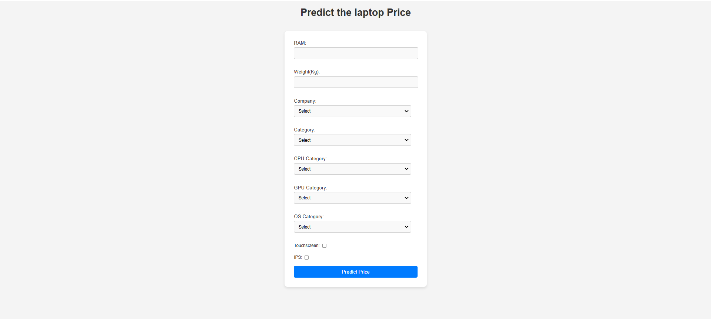

Laptop Price Predictor

Laptop Price Predictor website use a machine learning model trained with the Random Forest algorithm and build on flask server. 
The system allows users to input various laptop features (such as brand, RAM, storage, etc.), and based on those features, the model predicts the estimated price of the laptop.

